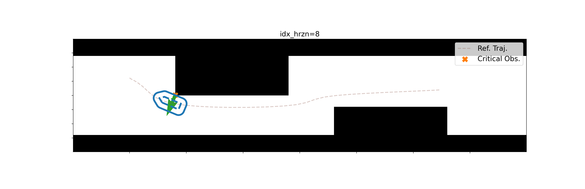
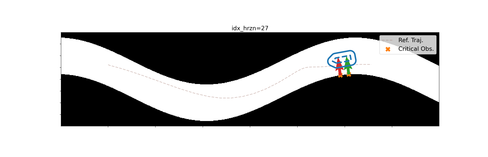

# Semi-Infinite Programming (SIP) for Collision Avoidance in Optimal and Model Predictive Control

<p align="center">
  <a href="#features">Features</a> •
  Installation (<a href="#installation-with-docker">with docker</a> / <a href="#installation-without-docker">without docker</a>) •
  <a href="#usage">Usage</a> •
  <a href=".github/docs/file_structure.md"> File Structure </a> •
  <a href="#license">License</a>
</p>

Official implementation of "Semi-Infinite Programming for Collision Avoidance in Optimal and Model Predictive Control"
 [](https://arxiv.org/pdf/2508.12335)


This repository provides solvers and controller plugins for collision avoidance in optimal and model predictive control (OCP/MPC), supporting both nominal and robust formulations. 
Robots are modeled as unions of padded polygons or capsules, and the environment is represented by points.
Such semi-infinite programming (SIP) optimal control problem (OCP) formulation enables navigation in confined spaces and straightforward adaptation to environmental changes.

## Features
1. Solvers for nominal and robust SIP OCPs for 2D mobile robot navigation.
2. Controller plugins in the [nav2 navigation stack](https://docs.nav2.org/index.html).
3. Solver for 3D car-seat placement tasks with a 7-DoF robot arm.


## Installation with docker

> ℹ️ Note: The build has been tested on Ubuntu 22.04 and 24.04. It is known to fail on macOS.

The most straightforward way to get started is with Docker.
To this end, first install [Docker](https://docs.docker.com/desktop/), and then build the docker image:
```bash
git clone https://github.com/boschresearch/sip_optimal_control.git sipoc
cd sipoc
./build_docker.sh
```
The installation can be lengthy (about 60-90 minutes) and needs around 10 GB of disk space, since many external dependencies are installed.
You can speed up the build by enabling more parallel threads in CMake, but this would increase memory usage and may lead to out-of-memory errors.
If you prefer to build the workspace locally, please refer to [the steps of installing without docker](#install-without-docker).

To run the Docker image:
```bash
./run_docker.sh
```

## Usage

### Task 1: Mobile robot navigation
#### Capsule-shaped robot:
```bash
python3  ./src/sipoc/sipoc_mobile_robot/sipoc_mr_solver/py_scripts/main_capsule_nominal_controller.py
```

<p float="left">
  
   
</p>

The world can be specified via `--world <world_name>`.
```bash
python3  ./src/sipoc/sipoc_mobile_robot/sipoc_mr_solver/py_scripts/main_capsule_nominal_controller.py --world L_corridor
```
#### Dilated-polygon robot:
```bash
python3  ./src/sipoc/sipoc_mobile_robot/sipoc_mr_solver/py_scripts/main_dilated_polygon_controller.py
```

<p float="left">
  
   
</p>

The world can also be specified as with the capsule-shaped robot.
The robust constraint satisfaction can be enabled with `--robustify`.
```bash
python3  ./src/sipoc/sipoc_mobile_robot/sipoc_mr_solver/py_scripts/main_dilated_polygon_controller.py --world s_corridor --robustify
```

<p float="left">
  
   
</p>
A safety margin, optimized within the OCP, is maintained between the robot and the obstacle for constraint robustification.


### Task 2: Car-seat placement (7-DoF robot arm)
Before running the planner and MPC, sample the point clouds over the car meshes.
Note that the MPC considers a cropped version of the point cloud.
```bash
./build/sipoc_ra_support/stl2octomap_generation
./build/sipoc_ra_support/stl2octomap_generation --x-bb -2.2 0.0
```
#### Motion Planning
```bash
ros2 launch sipoc_ra_ros2 sia20d_car_seat_planner_node.launch.py
```
The trajectory animated at the first is the trajectory for initialization (a linear interpolation of the joint configuration), followed by an animation of the optimized trajectory.

#### MPC
```bash
ros2 launch sipoc_ra_ros2 sia20d_car_seat_mpc_node.launch.py
```

## Installation without docker

### Prerequisite
  - ROS2 (humble or jazzy)
  - an [interactive backend for matplotlib](https://matplotlib.org/stable/users/explain/figure/backends.html) (e.g., [pyqt5](https://pypi.org/project/PyQt5/)) and [alphashape](https://pypi.org/project/alphashape/) (both are used for visualization)

### Step 1: Clone package and build third-party repos
#### Step 1.1 Install cargo (for the installation of [clarabel](https://clarabel.org/stable/rust/installation_rs/)) and pip packages
```bash
apt-get install cargo
cargo install --force cbindgen
export PATH="$PATH:<cargo_bin>"  # replace with your actual cargo bin
```

When using virtual environment such as `virtualenv`,
```bash
pip install jinja2 pyyaml typeguard catkin_pkg empy lark
```
The following package is only for visualization purpose
```bash
pip install alphashape
```

#### Step 1.2 Clone the repository
```bash
cd <workspace>/src  # replace with your actual ROS2 workspace root directory
git clone https://github.com/boschresearch/sip_optimal_control.git sipoc
cd ../
vcs import src < src/sipoc/third_party/third_party.repos
```

#### Step 1.3 Install dependencies using rosdep
```bash
sudo apt-get update -qq
```
```bash
rosdep install --from-paths src --ignore-src -r -y --skip-keys 'OpenVDB pybind11-dev Clarabel'
```

#### Step 1.4 Build Clarabel
```bash
cd src/third_party/Clarabel.cpp
git submodule update --init --recursive
mkdir cmake
cd ../../
cat ./sipoc/third_party/cmake/Clarabel_CMakeLists_addon.txt >> ./third_party/Clarabel.cpp/CMakeLists.txt
cp ./sipoc/third_party/cmake/Clarabel.pc ./third_party/Clarabel.cpp/cmake/
cd ../
colcon build --packages-select Clarabel --cmake-args -DCMAKE_BUILD_TYPE=Release -DCLARABEL_CARGO_HOME=./build/Clarabel
```

#### Step 1.5 Build other third-party libraries
```bash
colcon build --packages-select manif OpenVDB --cmake-args -DCMAKE_BUILD_TYPE=Release
colcon build --packages-select coal --cmake-args -DCMAKE_BUILD_TYPE=Release -DCOAL_USE_FLOAT_PRECISION=ON -DCOAL_HAS_QHULL=ON -DINSTALL_DOCUMENTATION=OFF -DBUILD_PYTHON_INTERFACE=OFF
```
> ℹ️ Note: : In case that it runs out of memory when building OpenVDB, build with fewer parallel threads: `export MAKEFLAGS="-j1"`.

### Step 2: Build and install sipoc packages
#### Step 2.2: Build utils, support, and ros2 interface

```bash
colcon build --symlink-install  --packages-select sipoc_mr_support sipoc_plot_utils sipoc_ros2_interfaces
colcon build --symlink-install  --packages-select sipoc_mr_utils sipoc_ra_utils sipoc_ra_support --cmake-args -DBUILD_TESTING=ON -DBUILD_PYBIND_LIB=ON -DCMAKE_BUILD_TYPE=Release
```
> ℹ️ Note: *stl2octomap_generation* built by *sipoc_ra_support* would have runtime errors without the cmake arguments `-DCMAKE_BUILD_TYPE=Release`


#### Step 2.3: Generate acados code
In another terminal, source the setup bash file. **If using a virtual environment, activate it**.
```bash
cd <workspace> # replace with your actual ROS2 workspace root directory
source install/setup.bash
```
Generate acados C code and copy the generated code to the include folder:
```bash
python3 ./src/sipoc/sipoc_mobile_robot/sipoc_mr_solver/py_scripts/generate_code_for_acados_solver.py --numerical_eval
python3 ./src/sipoc/sipoc_robot_arm/sipoc_ra_solver/py_scripts/generate_code_car_seat_min_length_ocp_solver.py
python3 ./src/sipoc/sipoc_robot_arm/sipoc_ra_solver/py_scripts/generate_code_car_seat_trajectory_tracking_ocp_solver.py
mkdir -p ./src/sipoc/sipoc_mobile_robot/sipoc_mr_solver/include/acados_generated_code/
mkdir -p ./src/sipoc/sipoc_robot_arm/sipoc_ra_solver/include/acados_generated_code/
cp -r ./c_generated_code_sipoc_mr/ ./src/sipoc/sipoc_mobile_robot/sipoc_mr_solver/include/acados_generated_code/
cp -r ./c_generated_code_sipoc_ra_planning/ ./src/sipoc/sipoc_robot_arm/sipoc_ra_solver/include/acados_generated_code/
cp -r ./c_generated_code_sipoc_ra_mpc/ ./src/sipoc/sipoc_robot_arm/sipoc_ra_solver/include/acados_generated_code/
rm acados_*.json
rm -r c_generated_code*
```

#### Step 2.4: Build OCP solvers and [nav2 controller plugins](https://docs.nav2.org/plugins/index.html) for mobile robot navigation
```bash
colcon build --symlink-install  --packages-select sipoc_mr_solver sipoc_mr_nav2_controller --cmake-args -DCMAKE_BUILD_TYPE=Release -DBUILD_PYBIND_LIB=ON -DBUILD_TESTING=ON
```

#### Step 2.4: Build OCP solvers for car-seat placement
```bash
colcon build --symlink-install  --packages-select sipoc_ra_solver sipoc_ra_ros2 --cmake-args -DCMAKE_BUILD_TYPE=Release -DBUILD_PYBIND_LIB=ON -DBUILD_TESTING=ON -DOpenVDB_DIR=$PWD/install/OpenVDB/lib/cmake/OpenVDB
```

### Step 3: Before running the [examples](#usage)
Source the workspace in a new terminal 
```bash
cd <workspace> # replace with your actual ROS2 workspace root directory
source install/setup.bash
```

## License

This project is open-sourced under the AGPL-3.0 license. See the
[LICENSE.AGPL-3.0](LICENSE.AGPL-3.0) file for details.

For a list of other open source components included in this project, see the
file [third_party_licenses.md](third_party_licenses.md).


## Contact

Please feel free to open an issue or contact personally if you have questions, need help, or need explanations. Don't hesitate to write an email to the following email address:
rubygaoyunfan@gmail.com